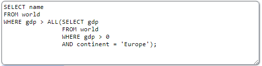
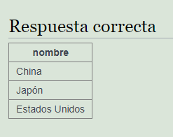
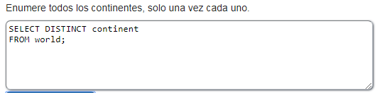
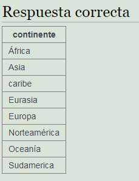

<h1><b>Operador ALL</b></h1>
Este operador indica que una condicion se cumple para todos los elementos de la tabla 
Se escribe así: WHERE <i>campo</i> <= ALL ( 
&nbsp&nbsp&nbsp&nbsp&nbsp&nbsp&nbsp&nbspSELECT <i>campo</i> 
&nbsp&nbsp&nbsp&nbsp&nbsp&nbsp&nbsp&nbspFROM <i>tabla</i> 
&nbsp&nbsp&nbsp&nbsp&nbsp&nbsp&nbsp&nbspWHERE <i>???</i> 
&nbsp&nbsp&nbsp&nbsp&nbsp&nbsp&nbsp&nbsp) 
 
Ejemplo: 

 
 
<h1><b>Operador DISTINCT</b></h1>
Este operador permite eliminar duplicados en la consulta 
Se escribe así: SELECT DISTINCT <i>campo</i> 
Ejemplo: 

