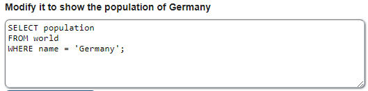

<h1><b>Estructura Básica</b></h1>
SELECT <i>campos de la tabla que se van a visualizar</i>  
FROM <i>nombre de la tabla</i>  
WHERE <i>campo de la tabla = valor que pueda haber;</i>   
<b>  El operador WHERE puede variar como veremos en otros casos, es opcional.</b> 

 
 
<h1><b>Operadores Aritméticos</b></h1>
Operador igual (=) 
Operador distinto (<>) 
Operador mayor (>) 
Operador menor (<) 
Operador mayor o igual (>=) 
Operador menor o igual (<=)
