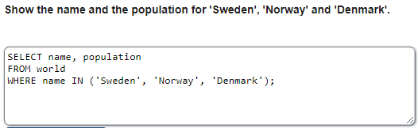

<h1><b>Operador IN</b></h1>
Este operador devuelve aquellos registros que coincida con la lista que hayamos puesto en IN. 
Se escribe así: <i>expresión</i> [NOT] IN(<i>valor1, valor2, . . .</i>) 
<b>La condición Not es opcional. Si se utiliza el NOT aparecerá todos los valores que no esten en la lista.</b> 
 
Ejemplo: 

 
 
<h1><b>Operador BETWEEN</b></h1> 
Este operador devuelve aquellos registros que esten entre los valores que hayamos puesto en BETWEEN. 
Se escribe así: <i>campo</i> [NOT] BETWEEN <i>valor1</i> AND <i>valor2</i> 
 
Ejemplo: 

