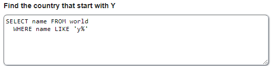
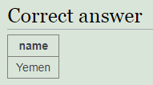
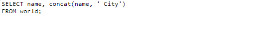
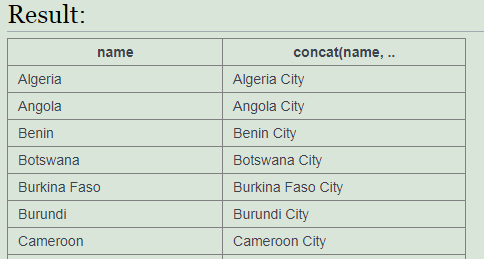
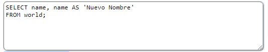
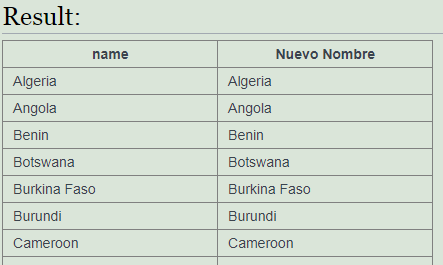

<h1><b>Operador LIKE</b></h1>
Este operador devuelve aquellos registros que coincidan con un modelo de expresión de SQL 
Se escribe así: <i>campo</i> LIKE <i>modelo</i> 
 
Ejemplo: 

 
<h3><b>Patrones para LIKE</b></h3>

 
 
<h1><b>Operador CONCAT</b></h1>
Este operador combina o junta dos o más cadenas. 
Se escribe así: CONCAT (<i>valor1, valor2</i>[<i>,valorN</i>]) 
 
Ejemplo: 

 
 
<h1><b>Operador AS</b></h1>
Este operador renombra el campo. 
Se escribe así: AS <i>‘nuevoNombre’</i> 
 
Ejemplo: 

