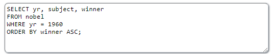
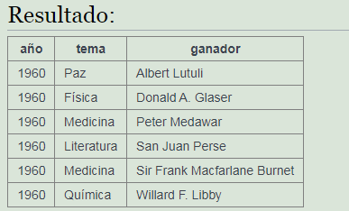
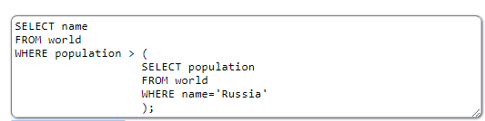
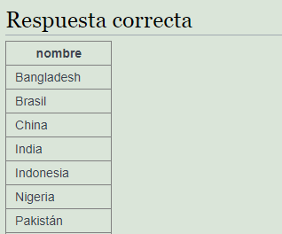

<h1><b>Operador ORDER BY</b></h1>
Este operador se encarga de ordenar de manera ascendiente o descendiente los resultados de una columna especifica. ASC ordena de menor a mayor y DESC de mayor a menor. 
Se escribe así: ORDER BY <i>campo</i> ASC (Se puede poner ASC o DESC o nada de esta forma sera de forma predeterminada) 
 
Ejemplo: 

 
 
<h1><b>Operador SELECT dentro de un WHERE</b></h1>
Este operador se usa para poder comparador los datos de una tabla con una en concreto de la misma tabla. 
Se escribe igual que la estructura basica pero detro del where. 
 
Ejemplo: 

)
