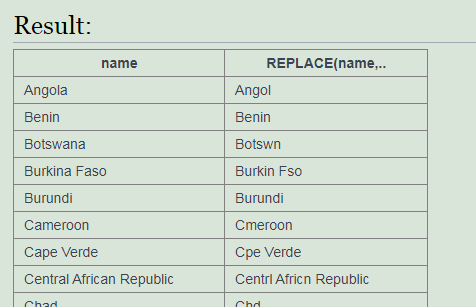

<h1><b>Operador REPLACE</b></h1> 
Este operador sustitute un valor o un digito de un campo por otro que demos nosotros. 
Se escribe así: REPLACE ( <i>campo</i> , <i>‘?’</i> , <i>‘?’</i> ) <b>(La ? Significa carácter)</b> 
 
Ejemplo: 

 
 
<h1><b>Operador OR</b></h1> 
Este operador se utiliza para poner otra condición a parte del WHERE y de esta manera sea o una o otro. 
Se escribe así: OR <i>campo</i> operador <i>valor</i> 
 
Ejemplo: 

 
 
<h1><b>Operador AND</b></h1> 
Este operador se utiliza para poner otra condición a parte del WHERE y de esta manera debe cumplirse las dos condiciones. 
Se escribe así: AND <i>campo</i> operador <i>valor</i> 
 
Ejemplo: 

