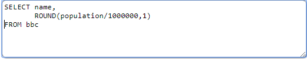
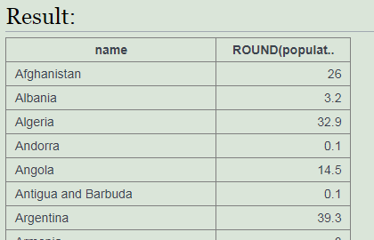
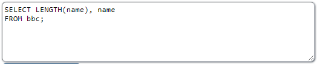
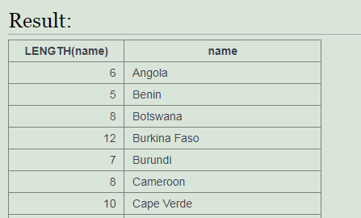
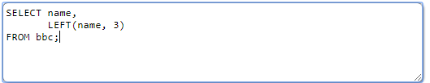
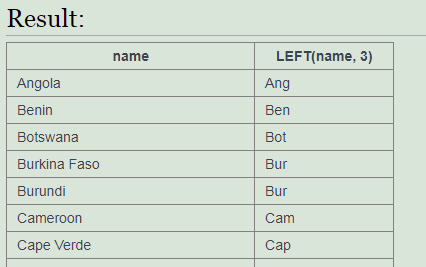

<h1><b>Operador ROUND</b></h1>
Este operador se utiliza para redondear un número a unos decimales. 
Se escribe así: ROUND(<i>numero,nº de decimales</i>) 
 
Ejemplo: 

 
 
<h1><b>Operador LENGTH</b></h1>
Este operador devuelve la longitud de una cadena. 
Se escribe así: LENGTH(<i>cadena</i>) 
 
Ejemplo: 

 
 
<h1><b>Operador LEFT</b></h1>
Este operador permite sacar n caracteres hacia la izquiera de una cadena. 
Se escribe así: LEFT(<i>cadena, n.º de caracteres</i>) 
 
Ejemplo: 

