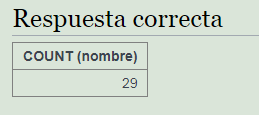
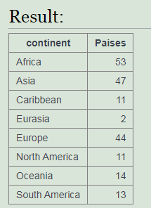

<h1><b>Operador SUM</b></h1>
Este operador permite obetener la suma total de una columna directa. 
Se escribe así: SUM(<i>campo</i>) 
 
Ejemplo: 

 
 
<h1><b>Operador COUNT</b></h1>
Este operador se utiliza para contar cuantas filas/ tuplas cumplen la condición. 
Se escribe así: COUNT(<i>campo</i>) 
 
Ejemplo: 

 
 
<h1><b>Operador GROUP BY</h1></b>
Este operador se utiliza para agrupar las filas (cuando sumas o cuentas) según la columna 
Se escribe así: GROUP BY <i>campo</i> 
 
Ejemplo:

 
 
<h1><b>Operador HAVING</b></h1>
Este operador se utiliza para hacer una condición que necesita sumar (SUM) o contar (COUNT). 
Se escribe así: HAVING COUNT (<i>campo</i>) > <i>???</i>; 
 
Ejemplo: 

